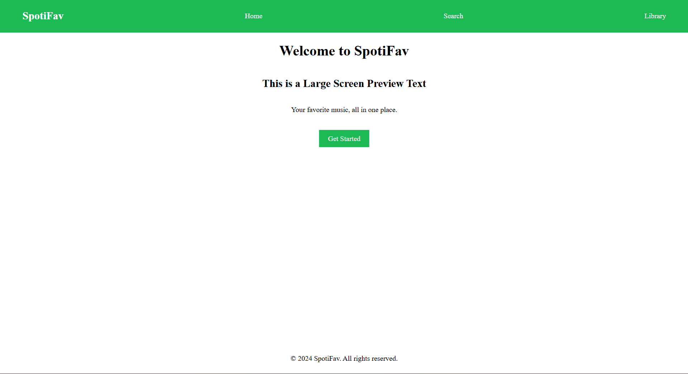

# Task 1

### Objective

- Basic Page including header, nav, main, footer sections
- CSS Required :
  - typography and color
  - margin and padding
  - simple responsive layout for mobile screens

### 1. Responsive Layout

**Media Query**

- Defined a media query that ensures layout changes when smaller screen (max width 600px) are viewing the content.
- Color of the navbar and action button changes to purple from green, along with a text showing which display the current preview page is for.

### 2. FlexBox

- flexible box display layout
- Lets us change spacing, alignment, and space between elements withing a container.
- Works best for dynamic layouts
- Properties:
  - Flex-grow: lets the child element grow to fill the empty space in the parent container
  - Flex-Direction: The direction flex box is applied. Rows (default) or cols
  - align-items: Vertical alignment and spacing in the container (default)
  - justify-content: Horizontal alignment and spacing in the container (default)

### 3. Spacing

- Margin: Space outside the container wall
- Padding: Space inside the container wall

### 4. Others

- Background-color: Changes from green to purple
- text-decorations: Removed defualt underline of anchor tag
- cursor: cursor type like pointer, help, etc.
- font-family: changed the font of whole page to "ui-monospace".

### 5. Output

