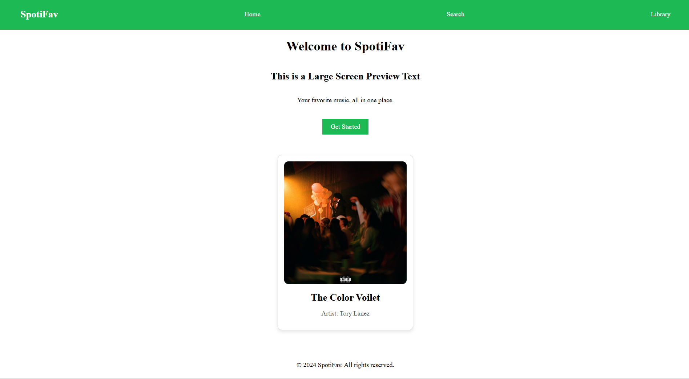
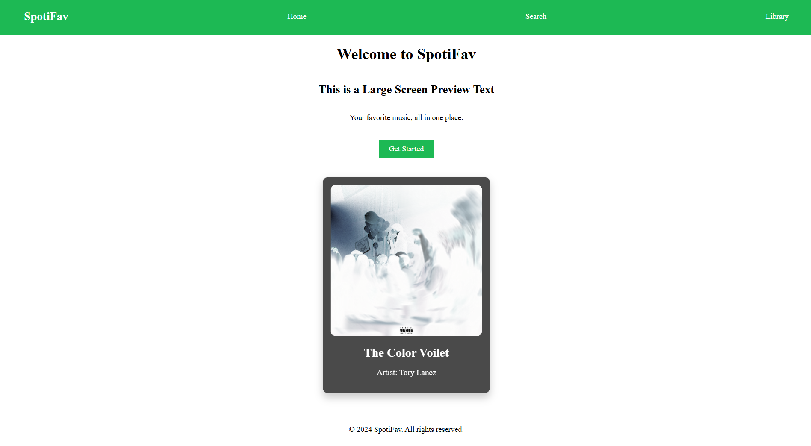

### Objective

- Basic Card using image, title and some desc
- CSS Required:
  - Border, shadows, paddings for space
  - hover effect to change color or size

==> **_Carried Over and built on top of Task 1 layout_** <==

### 1. Card

- _Used Album cover of a song i listen and make a card out of it_
- _width_ to limit the size of card
- solid _boarder_ of 1px width is used
- _padding_ and _margins_ are used to maintain adequate spacing within and between elements
- standard white _background color_
- transition property used to set transition speed for hover effect

### 2. Hover Effect

- Inverts the color of image using _filters_, also grayscale the inverted image to create a strong over effect
- Card size increase slightly to show that its in focus when hovering
- Put the conditional hover effect of image such that the effect in invoked as soon as the cursor lands on the card.

### 3. Output

#### Normal View

#### Hover Effect

