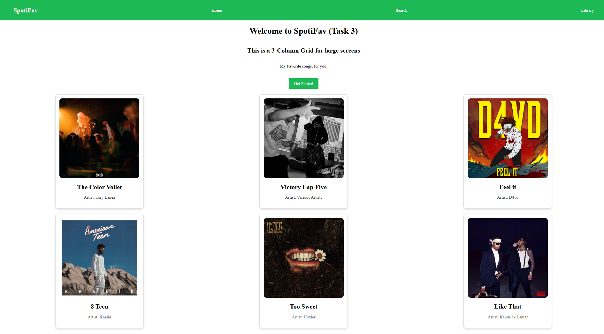
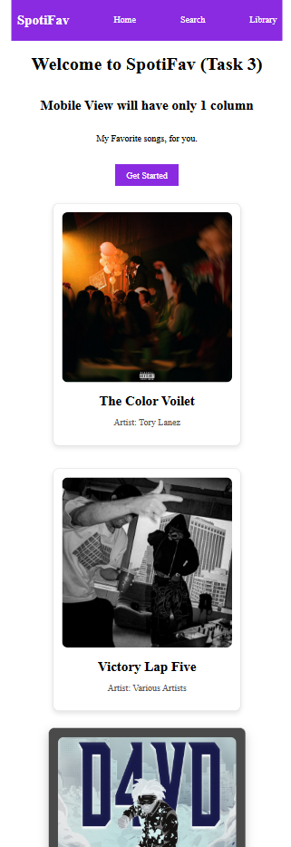

# Task 3

### Objective

- A grid layout
- CSS Required :
  - display as grid layout
  - grid cols
  - simple responsive layout for mobile screens that reduces the number of cols as we approch mobile screens
  - 3 cols for desktop layout, 2 cols for tablets, 1 col for mobile

### 1. Responsive Layout

**Media Query**

- Defined a media query that ensures layout changes when smaller screen (max width 600px) are viewing the content.
- Grid cols reduces from 3 in desktop screens(>1000px) to 2 on tablets screens(600-1000px) and then 1 on mobile screen(<600px)

### 2. Grid

- arrange elements in a predefined grid layout
- cols are defined in css file
- gap property is used to define the spacing between elements withing a grid layout
- place-items and justify-items are used to align items horizontally and vertically withing a section of grid.

### 3. Output

**Desktop View**

**Mobile View**

