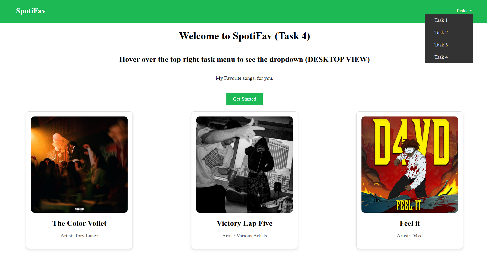
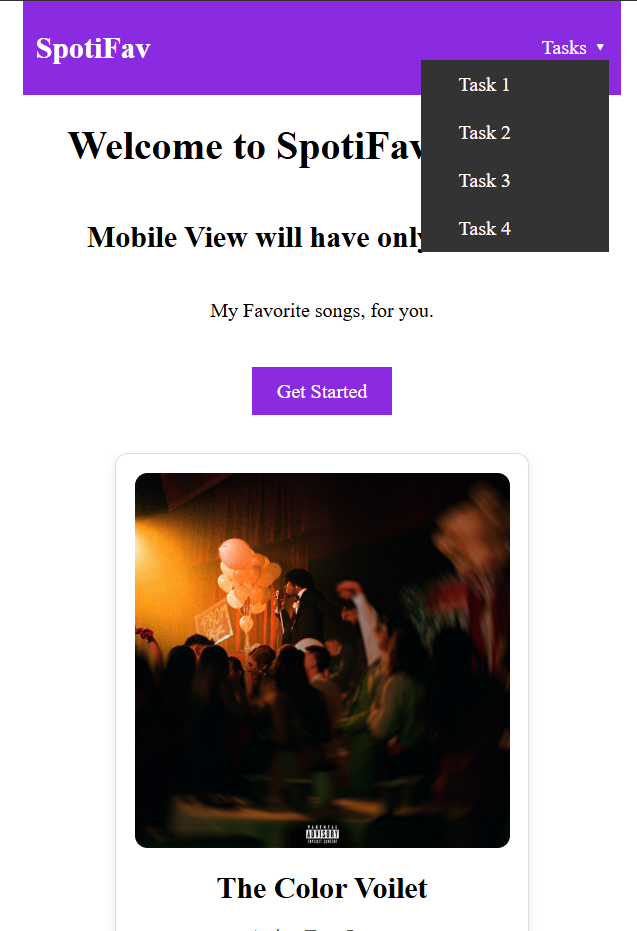

# Task 4

### Objective

- Design a dropdown menu purely out of css

### 1. Properties Used

- Used opacity and visibility properties to hide it when not hovered and show when cursor is hovered over the nav link
- applied a translationY property with 0.5 sec transition for smooth in and out animation when hovering over the menu

### 3. Output

**Desktop View**

**Mobile View**

