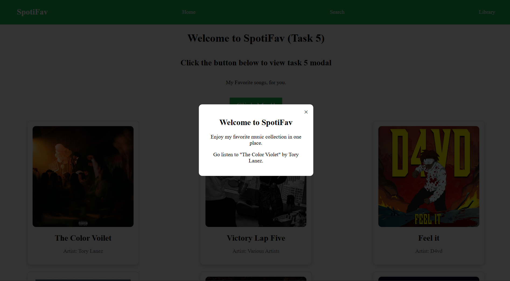

# Task 5

### Objective

- Build a Pop-up Window(modal) using pure css

### 1. Properties Used

- Used the pseudo-class _**:target**_
- When button is pressed, it redirects the url to _".../#modal"_, this invokes the _:target_ effect
- The pop-up window is only visible when the url stays at _"../#modal"_.
- When close button is pressed, it redirects the page and url back thus removing the focus from pop-up window and removing the _:target_ effect

- _Transition effect_ on opacity to generate a smooth animation when the modal pops up
- Minor syling on _Close button_ of modal
- Added a opacity filter using _rgba_ property to create a _depth effect_
- Used scale property to animate the zoom effect when pop-up window is opened

### 3. Output

